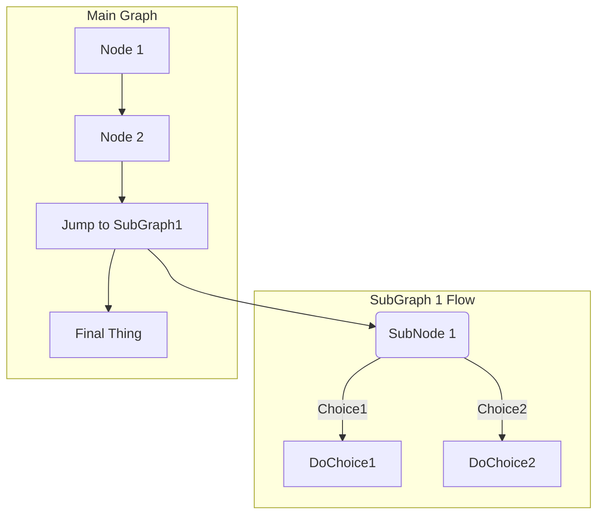

What criteria are used in deciding whether to use an open source component?

Popularity
Feature Set
Ease of integration
Security history (e.g. have there been multiple high-risk CVEs)
Rate of fixes (frequency of security and bug fixes)
OSS license
Commercial Support Available
Foundation/Corporate Sponsorship

options:
 Always Used
 Frequently Used
 Occasionally Used
 Rarely Used
 Never Used
